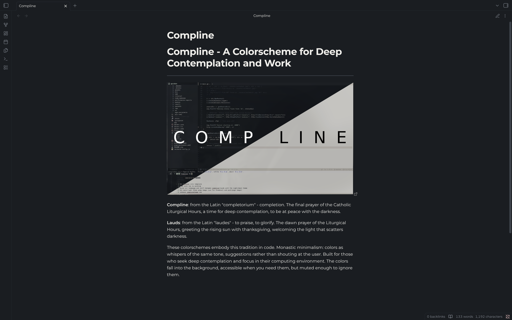

# Compline

A contemplative theme for [Obsidian](https://obsidian.md), based on the [Compline color palette](https://complinetheme.com).



## About

Compline is designed for focused, distraction-free writing with carefully selected muted colors that are easy on the eyes during extended use.

The theme includes two variants:

- **Compline** (Dark) - A deep, warm dark theme for nighttime contemplation
- **Lauds** (Light) - A soft, warm light theme for daytime use

Both themes share the same carefully crafted palette designed for readability and visual harmony.

## Installation

### From Community Themes

1. Open Obsidian Settings
1. Go to Appearance
1. Click "Manage" under Themes
1. Search for "Compline"
1. Click Install and then Use

### Manual Installation

1. Download `theme.css` and `manifest.json` from this repository
1. Create a folder called `Compline` in your vault's `.obsidian/themes/` directory
1. Copy the downloaded files into the `Compline` folder
1. Open Obsidian Settings > Appearance and select "Compline"

### Through Nix

If you manage your obsidian config via Nix you may do the equivalent of:

```nix
{
  inputs.obsidian-compline.url = "github:baileylu121/obsidian-compline";

  outputs = { obsidian-compline, ... }:
    themesDir = linkFarm "obsidian-themes" [
      { name = "Compline"; path = obsidian-compline; }
    ];
}
```

## Color Palette

### Compline (Dark)

| Color | Hex | Usage |
|-------|-----|-------|
| Background | `#1a1d21` | Primary background |
| Background Alt | `#22262b` | Secondary background |
| Foreground | `#f0efeb` | Primary text |
| Foreground Alt | `#ccc4b4` | Secondary text |
| Blue | `#b4bcc4` | Links, accents |
| Green | `#b8c4b8` | Success, strings |
| Yellow | `#d4ccb4` | Warnings, highlights |
| Red | `#cdacac` | Errors, important |
| Cyan | `#b4c0c8` | External links, info |
| Teal | `#b4c4bc` | Tags, examples |

### Lauds (Light)

| Color | Hex | Usage |
|-------|-----|-------|
| Background | `#f0efeb` | Primary background |
| Background Alt | `#e0dcd4` | Secondary background |
| Foreground | `#1a1d21` | Primary text |
| Foreground Alt | `#4a4d51` | Secondary text |
| Blue | `#5a6b7a` | Links, accents |
| Green | `#5a6b5a` | Success, strings |
| Yellow | `#8b7e52` | Warnings, highlights |
| Red | `#8b6666` | Errors, important |
| Cyan | `#64757d` | External links, info |
| Teal | `#4d6b6b` | Tags, examples |

## Credits

- Color palette by [Joshua Blais](https://joshblais.com)
- Palette reference: [complinetheme.com](https://complinetheme.com/palette)
